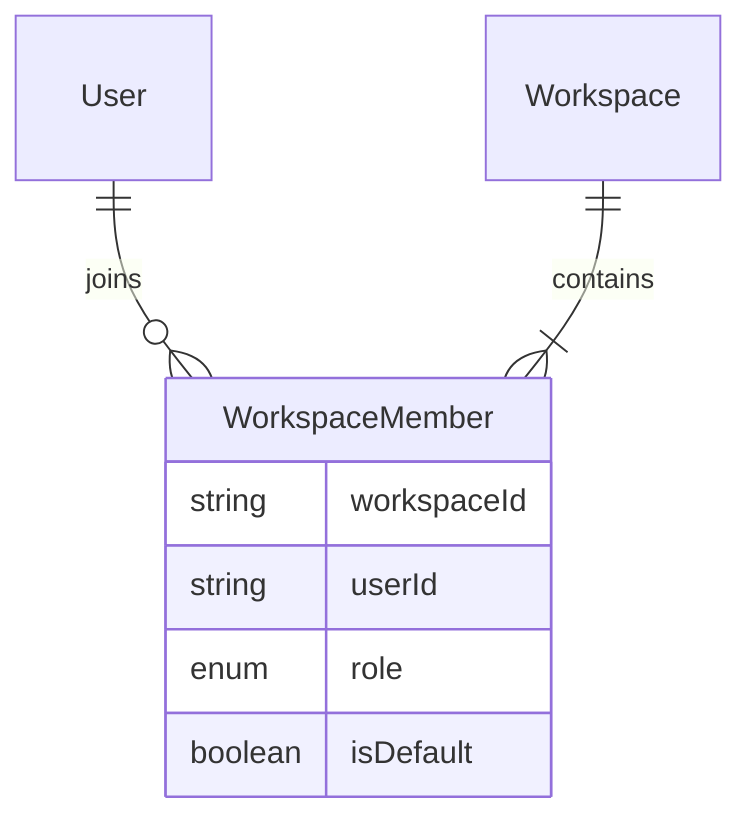
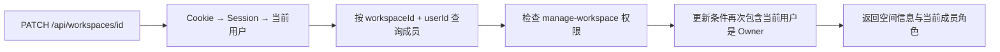

# RBAC 第一阶段：Workspace 与成员权限基础

本阶段已实现后端基础。暂时没有空间切换界面、成员管理接口，也没有把 Todo/Group 的归属从用户改成 Workspace。原任务列表继续按 `userId` 隔离，新建空间还不能用来共享任务。

## 为什么先做这一批

原系统回答的是“这个任务是不是你的”，协作系统需要先回答“你是不是这个空间的成员、在这个空间能做什么”。先建立成员关系和授权入口，可以单独验证身份与角色边界，再迁移任务归属，减少一次改动同时改变数据结构、接口与界面的范围。

第一批可观察的行为：

- 应用新 migration 后，每个旧账号获得一个名为 `Personal` 的默认空间，成为 Owner；原账号、Session、分组和任务不变。
- 注册通过 Prisma 嵌套写入，同时创建账号、空间和默认 Owner 成员关系，成功后创建 Session。
- 登录用户可以通过 API 列出自己参与的空间、创建新空间、读取空间信息；只有 Owner 可以改名。
- 空间和成员关系是两个实体，同一个人可以在不同空间有不同角色。
- 账号注销会删除其独享空间；若仍是共享空间的 Owner，则返回 409，保留账号与数据。转让接口尚未实现，所以这一批不开放成员添加界面。

## 数据模型与约束

`WorkspaceMember` 的主键是 `(workspaceId, userId)`，防止重复加入同一个空间。`role` 使用数据库枚举 `OWNER / EDITOR / VIEWER`。`isDefault` 放在成员关系上，因为默认空间是某个用户的选择。

每个空间恰好一个 Owner，拆成两个约束理解：

1. 部分唯一索引只索引 `role = OWNER` 的行，防止出现两个 Owner。
2. 延迟约束触发器在事务提交时检查空间有一位 Owner，防止创建无 Owner 空间、删除或降级唯一 Owner。空间整体删除时不要求 Owner 继续存在。

检查延迟到事务提交，允许在一个事务内先创建空间再创建 Owner，也允许后续实现转让时先降级原 Owner、再提升新 Owner；事务失败会整体回滚。数据库层已经测试了这种转让顺序，但本阶段没有开放转让 API。

默认空间也有部分唯一索引，保证一个用户最多标记一个默认空间；注册流程和旧数据 migration 各自创建一个。它不意味着数据库会自动为任意直接插入的 User 创建默认空间。

这些部分索引与触发器维护在 migration SQL 中，Prisma schema 的注释标明这一点。后续修改模型时应检查它们，使用 migration 部署，不能用 `db push` 替代这些手写约束。Prisma Client 由现有 generator 生成，生成文件沿用工具的命名和结构。

## 请求如何经过服务端

以“改名”为例：

这里的 `userId` 来自服务端 Session，角色来自数据库成员关系。请求 body 中的 `role`、`userId`、`members` 等字段不会参与授权。每次请求重新读取成员关系，不把空间角色存进 Session，成员被移除后原 Session 无法继续访问该空间。

状态码含义：

| 状态码 | 条件                                                     |
| ------ | -------------------------------------------------------- |
| 401    | 没有有效 Session                                         |
| 404    | 空间不存在，或当前用户不是成员；统一响应避免暴露其他空间 |
| 403    | 是成员，但角色没有所需权限                               |
| 400    | 名称为空、类型错误、超出 80 个字符等                     |
| 409    | 读取授权后写入条件失效，或注销事务遇到并发冲突           |
| 500    | 空间 API 的数据库等内部错误，返回通用提示                |

空间改名的写入条件再次包含 Owner 身份。注销中的成员检查、独享空间删除与账号删除放在同一个 Serializable 事务中，冲突返回 409，并且不会清除 Session。未来的成员调整和转让也需要事务与一致的并发策略。

## 本阶段接口

| 接口                                 | 行为                                                                         |
| ------------------------------------ | ---------------------------------------------------------------------------- |
| `GET /api/workspaces`                | 按当前用户的成员关系列出空间，默认空间优先；允许空数组                       |
| `POST /api/workspaces`               | 接收 `{ "name": "Team" }`，原子创建空间和当前用户的 Owner 成员关系，返回 201 |
| `GET /api/workspaces/:workspaceId`   | 成员读取空间信息，返回自己的角色和默认标记                                   |
| `PATCH /api/workspaces/:workspaceId` | Owner 改名；Editor 和 Viewer 均返回 403                                      |

同名空间目前允许存在，名称用于展示，`id` 用于资源定位。`read / write / manage-members / manage-workspace` 是权限策略中的四种能力；本批接入空间读取与管理。任务写入和成员管理仍待下一阶段接入，权限函数通过不代表完整协作已完成。

## 测试如何证明有效

- 策略单元测试覆盖三个角色和四种能力，也验证未知角色默认拒绝。
- Route Handler 测试验证 Session 身份、输入字段注入、401/403/404、空列表、异常响应和写入时的权限条件。
- 注册测试验证默认空间和 Owner 的嵌套写入结构，以及成功后才创建 Session。
- 真实 PostgreSQL 测试使用真实 Prisma、Session 和接口，直接请求改名接口，证明 Viewer/Editor 绕过界面仍被拒绝。
- 数据库测试验证重复成员、第二个 Owner、没有 Owner、第二个默认空间均被拒绝，并验证嵌套写入失败回滚。
- 旧数据测试在临时数据库的独立 schema 中应用旧 migration、插入旧账号和任务，再应用新 migration；对比四张旧表的每个字段均不变。
- 账号测试验证共享 Owner 注销失败时保留数据与 Session，普通成员注销后保留别人的空间。

运行 `pnpm typecheck`、`pnpm exec tsc6 --noEmit --incremental false`、`pnpm lint`、`pnpm test` 和 `pnpm test:integration`。不运行 build，不在开发数据库上执行测试或 migration。

## 你需要能解释的面试问题

**为什么不在 User 表加一个全局 role？** 同一个人在自己的空间是 Owner，在同学的空间可能是 Viewer。角色属于用户与空间的关系。

**认证和授权有什么区别？** Session 告诉服务端你是谁；成员关系与权限策略决定你在这个空间能做什么。登录成功不代表能读取任意空间。

**为什么要测试直接调用 API？** 隐藏按钮只影响界面。用户能构造请求，所以服务端必须独立检查权限。

**为什么有唯一索引，还需要延迟检查？** 唯一索引保证最多一个 Owner，不能保证至少一个。延迟检查保证提交后有一个，同时允许事务中的合理中间状态。[PostgreSQL 部分索引](https://www.postgresql.org/docs/current/indexes-partial.html)

**为什么这次没有直接改所有 Todo 接口？** 先提交可验证的成员关系与授权基础；下一批再改变资源归属，分别证明数据迁移和权限生效。这一批仍不能在简历上写“完整 Workspace 协作已实现”。

练习：用自己的话说明 Viewer 请求改名时在哪一步被拒绝；再解释同一个用户为什么可以拥有两个不同角色。下一批重点是将 Group/Todo 归属迁移到 Workspace、保留旧任务，并让 Editor/Viewer 权限真正作用于任务接口。
